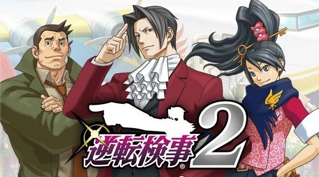

# Gyakuten Kenji 2

<!--  -->

- [Episode 1: Turnabout Target](https://strategywiki.org/wiki/Gyakuten_Kenji_2/Episode_1:_Turnabout_Target)
    - [Beginning](https://strategywiki.org/wiki/Gyakuten_Kenji_2/Episode_1:_Turnabout_Target/Beginning)
    - [End](https://strategywiki.org/wiki/Gyakuten_Kenji_2/Episode_1:_Turnabout_Target/End)

- [Episode 2: The Imprisoned Turnabout](https://strategywiki.org/wiki/Gyakuten_Kenji_2/Episode_2:_The_Imprisoned_Turnabout)
    - [Beginning](https://strategywiki.org/wiki/Gyakuten_Kenji_2/Episode_2:_The_Imprisoned_Turnabout/Beginning)
    - [Middle](https://strategywiki.org/wiki/Gyakuten_Kenji_2/Episode_2:_The_Imprisoned_Turnabout/Middle)
    - [End, Part 1](https://strategywiki.org/wiki/Gyakuten_Kenji_2/Episode_2:_The_Imprisoned_Turnabout/End,_Part_1)
    - [End, Part 2](https://strategywiki.org/wiki/Gyakuten_Kenji_2/Episode_2:_The_Imprisoned_Turnabout/End,_Part_2)

- [Episode 3: The Inherited Turnabout](https://strategywiki.org/wiki/Gyakuten_Kenji_2/Episode_3:_The_Inherited_Turnabout)
    - [Beginning, Part 1](https://strategywiki.org/wiki/Gyakuten_Kenji_2/Episode_3:_The_Inherited_Turnabout/Beginning,_Part_1)
    - [Beginning, Part 2](https://strategywiki.org/wiki/Gyakuten_Kenji_2/Episode_3:_The_Inherited_Turnabout/Beginning,_Part_2)
    - [Middle, Part 1](https://strategywiki.org/wiki/Gyakuten_Kenji_2/Episode_3:_The_Inherited_Turnabout/Middle,_Part_1)
    - [Middle, Part 2](https://strategywiki.org/wiki/Gyakuten_Kenji_2/Episode_3:_The_Inherited_Turnabout/Middle,_Part_2)
    - [Middle, Part 3](https://strategywiki.org/wiki/Gyakuten_Kenji_2/Episode_3:_The_Inherited_Turnabout/Middle,_Part_3)
    - [Middle, Part 4](https://strategywiki.org/wiki/Gyakuten_Kenji_2/Episode_3:_The_Inherited_Turnabout/Middle,_Part_4)
    - [End, Part 1](https://strategywiki.org/wiki/Gyakuten_Kenji_2/Episode_3:_The_Inherited_Turnabout/End,_Part_1)
    - [End, Part 2](https://strategywiki.org/wiki/Gyakuten_Kenji_2/Episode_3:_The_Inherited_Turnabout/End,_Part_2)
    - [End, Part 3](https://strategywiki.org/wiki/Gyakuten_Kenji_2/Episode_3:_The_Inherited_Turnabout/End,_Part_3)

- [Episode 4: The Forgotten Turnabout](https://strategywiki.org/wiki/Gyakuten_Kenji_2/Episode_4:_The_Forgotten_Turnabout)
    - [Beginning, Part 1](https://strategywiki.org/wiki/Gyakuten_Kenji_2/Episode_4:_The_Forgotten_Turnabout/Beginning,_Part_1)
    - [Beginning, Part 2](https://strategywiki.org/wiki/Gyakuten_Kenji_2/Episode_4:_The_Forgotten_Turnabout/Beginning,_Part_2)
    - [Middle, Part 1](https://strategywiki.org/wiki/Gyakuten_Kenji_2/Episode_4:_The_Forgotten_Turnabout/Middle,_Part_1)
    - [Middle, Part 2](https://strategywiki.org/wiki/Gyakuten_Kenji_2/Episode_4:_The_Forgotten_Turnabout/Middle,_Part_2)
    - [End, Part 1](https://strategywiki.org/wiki/Gyakuten_Kenji_2/Episode_4:_The_Forgotten_Turnabout/End,_Part_1)
    - [End, Part 2](https://strategywiki.org/wiki/Gyakuten_Kenji_2/Episode_4:_The_Forgotten_Turnabout/End,_Part_2)

- [Episode 5: The Grand Turnabout](https://strategywiki.org/wiki/Gyakuten_Kenji_2/Episode_5:_The_Grand_Turnabout)
    - [Beginning, Part 1](https://strategywiki.org/wiki/Gyakuten_Kenji_2/Episode_5:_The_Grand_Turnabout/Beginning,_Part_1)
    - [Beginning, Part 2](https://strategywiki.org/wiki/Gyakuten_Kenji_2/Episode_5:_The_Grand_Turnabout/Beginning,_Part_2)
    - [Middle, Part 1](https://strategywiki.org/wiki/Gyakuten_Kenji_2/Episode_5:_The_Grand_Turnabout/Middle,_Part_1)
    - [Middle, Part 2](https://strategywiki.org/wiki/Gyakuten_Kenji_2/Episode_5:_The_Grand_Turnabout/Middle,_Part_2)
    - [End](https://strategywiki.org/wiki/Gyakuten_Kenji_2/Episode_5:_The_Grand_Turnabout/End)

### Navigation

- [Back to Home](../../home.md)  
- [Back to Games](../../games.md)
- [Back to Ace Attorney Investigations](../ace_attorney_investigations.md)